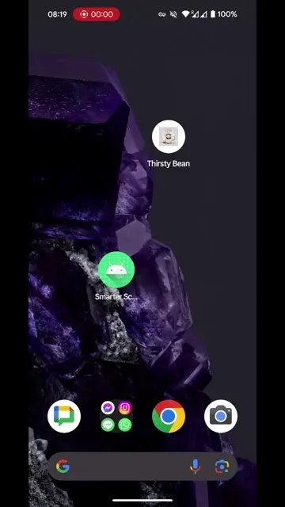

# SmarterScale

*Let's make that smart scale a little less dumb*

This is a simple app that reads weighing scale number using your phone camera (OCR),
and writes it to [Android Health Connect](https://health.google/health-connect-android/).

Interested? Download the [apk](https://github.com/drinkcat/SmarterScale/releases/download/v1.0/smarterscale-v1.0.apk).
(You will need to authorize installing apps from "Unknown Sources", the flow on your
particular Android flavor may vary).

I might end up publishing this on the Play Store, but I need enough people interested
in testing early version. If you are interested, please join
[this group](https://groups.google.com/g/smarterscale-testers), and I will send you an email
if and when this happens.

## Usage

To use the app, follow these steps:
 1. Step on scale, wait for a reading.
 2. Open SmarterScale app on your phone.
 3. Point at the number, keeping it straight.
    - Pinch to zoom to fit the numbers within the red rectangles (zoom level will be remembered across readouts).
    - You might want to get your phone closer to the ground for a better reading, e.g. hold it at arm's length.
 5. Once the number is recognized, press "Submit"
 6. This will write the number to Android Health Connect API, which can then be read using many other apps (e.g. Google Fit).

Or in video form, takes less than 10 seconds:

## Background

I have a smart scale that is supposed to be able to connect via Bluetooth, but the connection often fails,
so I was looking for a simplified flow to record the weight (that doesn't require Bluetooth, or buying
a new scale...).

The original flow is supposed to look like this:
 1. Step on scale, wait for weight to be measured (the display blinks and holds the measured wait).
 2. Open scale app
 3. Press on "+" then "Weight" (that steps wasn't necessary at some point in the past?).
 4. Wait at this screen, and hope that it automatically connects to the scale (in my experience this often fails).
 5. Press submit.

As you can see, the flow isn't _that_ different from what SmarterScale does, and in my (limited) experience, SmarterScale is more reliable.

## Supported hardware

I've only tested this on a Fitbit Aria Air scale. The display makes it easy to read out the
digits: It is relatively large, bright, and there is enough gap between the segments for
my simple algorithm to work.

You're welcome to try it out on other scales.

## More technical background

The computer vision algorithm is very simple, and uses OpenCV. There's 4 main steps:
 - Threshold the image (blur, local adaptive threshold, some morphological opening)
 - Look for horizontal and vertical segments (this assume there is enough gap between the segments)
 - Group those segments into digits
   - Figure out which digit it is based on segment position.
   - Extract number based on those digits.
 - Once we extract the same number a few times, across different frames, consider it good.

I had more complex logic in earlier version of the app, but the above seems to work well enough,
and at least for the scale in question, is quite resiliant to external lighting changes.

Caveats/limitations:
 - I do not attempt to extract the "dot" position. I assume that most scales show it in a fixed position
(e.g. the scale can only display numbers in this format `XX.Y`).
 - Fixed unit. I only support `kg` for now, but adding support for `lb` would be easy.
 - Computer vision algorithm has a bunch of parameters that _may_ need to be tuned for
   other displays.
 - AI? I wonder if the code could be more reliable if we had smarter digit detection.
   I considered using [ML Kit Text Recognition v2](https://developers.google.com/ml-kit/vision/text-recognition/v2)
   but that doesn't seem to support 7-segment displays, and I didn't want to use an online
   solution (e.g. [Cloud Vision API](https://cloud.google.com/vision/docs/ocr)), as this
   has other issues (privacy, cost, etc.).

Also, I'm absolutely not an Android developer:
 - The app is a mix of Java and Kotlin as all OpenCV Android examples use Java, while the Health
   Connect API appears to require Kotlin (suspend functions are a bit challenging to call from Java).
 - I'd welcome a [second pair of eyes](https://www.osnews.com/story/19266/wtfsm/) on the code.

### What about openScale?

I even tried to understand if I could add support for my Fitbit Aria Air in
[openScale](https://github.com/oliexdev/openScale), but sadly the data appears to be
[encrypted](https://github.com/oliexdev/openScale/issues/1105). And even if I could add support,
this may not have helped, as I'm not sure if the connectivity(?) issues with my scale
would be fixed with another app.
